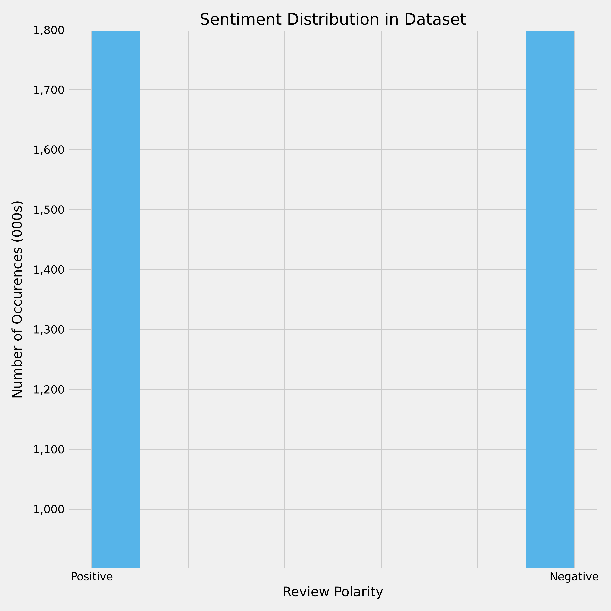
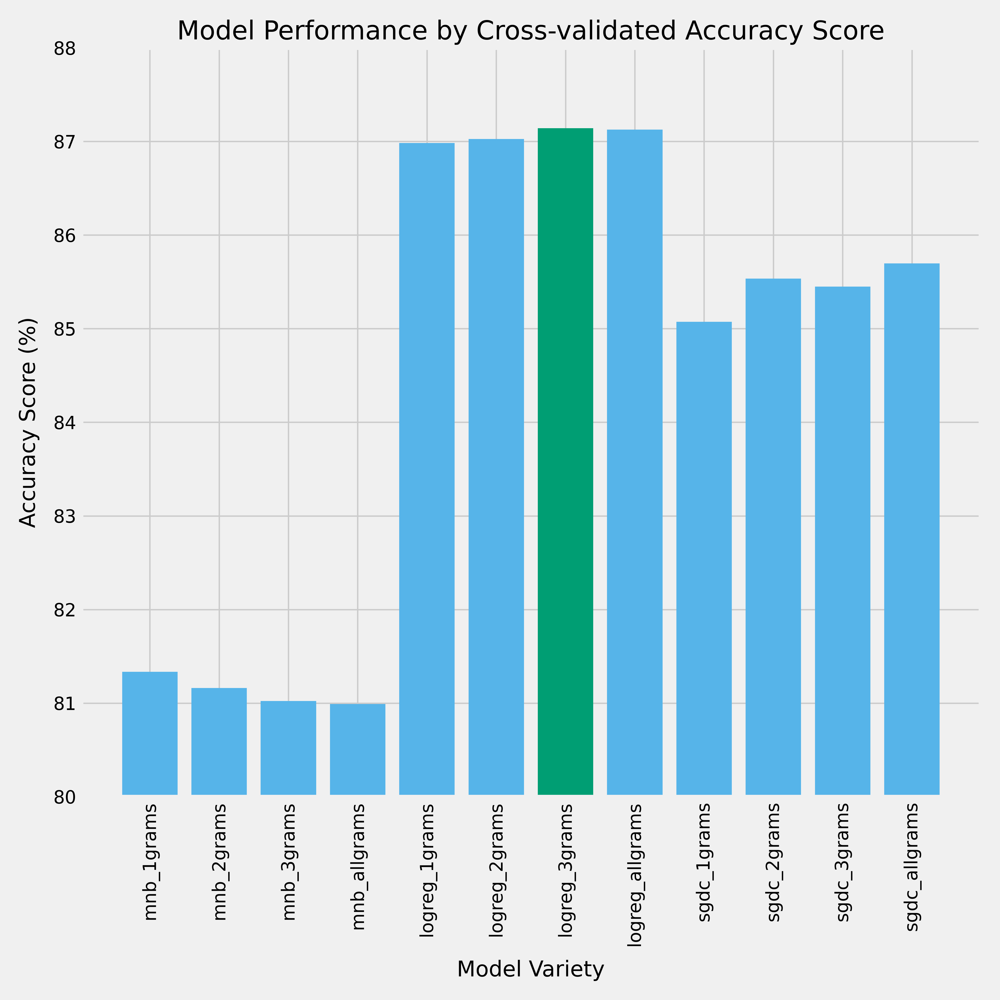

Photo by <a href="https://unsplash.com/@towfiqu999999?utm_source=unsplash&utm_medium=referral&utm_content=creditCopyText">Towfiqu barbhuiya</a> on <a href="https://unsplash.com/s/photos/customer-ratings?utm_source=unsplash&utm_medium=referral&utm_content=creditCopyText">Unsplash</a>
  
# I HATE this Product! Five Stars!
### Reducing Rating Inflation Using NLP
Author: Tom Chapman | [email](mailto:thomas.h.chapman@gmail.com) | [linkedin](https://www.linkedin.com/in/thomashchapman/) | [github](https://github.com/ThomasHChapman)

Most online marketplaces use 5-star product rating systems which are prone to rating inflation, obscuring product quality and customer sentiment. In addition to being problematic for the consumer, rating inflation makes it difficult for sellers to parse customer feedback and understand how their products are being received by the public. My project uses natural language processing to train a model on review sentiment so that it can be used to accurately classify customer reviews based on their content.


## Business Understanding
Since their inception, online marketplaces have fundamentally shifted how consumers shop. With a near limitless number of products and services available online, it has never been easier to avoid the hassle of brick-and-mortar stores. However, identifying which products or services are high-quality has become increasingly difficult. The popularity of the 5-star rating scale has led to a number of well-documented challenges. [Harvard Business Review](https://hbr.org/2019/07/the-problems-with-5-star-rating-systems-and-how-to-fix-them) summed these challenges up nicely as follows:

- There is little incentive for consumers to provide truthful feedback, meaning that extreme experiences (whether positive or negative) are much more likely to lead a consumer to leave a review.
- Compounding the lack of incentive for truth, 5-star rating scales are prone to grade inflation. There is no correlation between the star-rating and the sentiment the user expresses in a review. It's possible (and surprisingly common) for a user to hate a product, excoriate it in a review, and then rate it 5-stars. This leads to inflated ratings, and makes it harder for the consumer to understand the meaning behind varied product ratings. How much better is a product with a 4.7 star rating than a 4.5 star average rating?
My model is intended to help address rating inflation by classifying user feedback as positive or negative based on its content.

Amazon is the largest online marketplace currently in existence, and its challenges with rating inflation are [common knowledge](https://www.nytimes.com/2021/06/18/technology/amazon-reviews.html). However, any marketplace that uses a five-star rating system (Google Play, Apple App Store, Chewy, Wal-mart, Etsy, Rakuten, etc.) can utilize my model to reclassify user reviews into positive or negative polarity. Offering customers a clearer display of product quality allows customers to make more informed purchases, and should drive improved satisfaction. It should also help mitigate poor quality or scam sellers inherently, as poor reviews are less likely to be drowned out by inflated ratings.

The tool is also useful for sellers that want to move away from Amazon or implement their own storefront. By implementing my algorithm in a newly-created storefront, sellers can mostly automate the classification of consumer feedback and derive a more accurate understanding of how their products or services are being received. On average, Amazon sellers pay the website about 15% of their sale price on each item sold. There's no question the visibility and customer reach that Amazon provides is valuable, but 15% is an extremely hefty cost for small companies. For certain product categories, the cost per item can range as high as 45%, an enormous amount to pay simply for the storefront component of the site.


## Data Understanding
The data used in this project is a publicly-available dataset hosted by Kaggle. The dataset is a subset of the Stanford Network Analysis Project (SNAP), which contains approximately 34 million Amazon reviews collected over a 13 year period. Our dataset consists of 1.8 million training samples in each polarity (positive or negative) and 200,000 validation samples in each polarity. The subset was created by labelling reviews that assigned a 1-2 star rating to the negative polarity, and reviews with a 4-5 star rating to the positive polarity. Ratings that gave 3 stars were omitted entirely.



Because my goal is to train a classifier that will generalize well across different kinds of products, I chose a very large dataset that did not specialize in any one category. My hope is that this choice will drive greater accuracy on both Amazon reviews and reviews from other data sources. The datset is available for download from [the source page](https://www.kaggle.com/datasets/kritanjalijain/amazon-reviews). By default, the notebooks look for them in the ./data folder of the repository, so be sure to save them correctly for reproduceability. 

### Reproduction Instructions
To replicate the environment used for this project, follow the below steps:
1. Download the [environment.yml](environment/environment.yml) file
2. Before launching the notebook, execute the below lines of code from the folder containing the environment.yml file:
```
{
    - conda env create -f environment.yml
    - conda activate rc-env
    - python -m ipykernel install --user --name rc-env --display-name rc-environment
}
```


[create a new environment](https://conda.io/projects/conda/en/latest/user-guide/tasks/manage-environments.html) using anaconda.

- Download the [Amazon review dataset](https://www.kaggle.com/datasets/kritanjalijain/amazon-reviews?select=train.csv). By default, the notebooks look for them in the ./data folder, so be sure to save them accordingly after unzipping.

## Modeling Process
Given the size of my dataset, I focused on models with reasonably short training times that have strong utility in natural language processing. I iterated through multinomial naive bayes classifiers, logistic regression classifiers, and logistic regression classifiers using stochastic gradient descent. The size of the dataset made decision tree-based classifiers prohibitively time-consuming, and did not allow me to complete grid searches on my models. The grid search process quickly consumed all available memory on my local machine, and there are no free resources with larger RAM allocations than what I have available (64GB).

Instead of tweaking hyper parameters, I ran several iteration of each model with different combinations of tokens. Each model was evaluated based on its cross-validated accuracy score when receiving single word tokens, single words and bi-grams, single words and tri-grams, and a combination of all three tokens (referred to as allgrams in the notebooks).




### Final Model Evaluation
The logistic regression model that trained on a combination of 1-grams and 3-grams had the highest accuracy score, so I selected it as the appropriate model for this task. The model's accuracy was only very slightly (0.004%) better than a similarly-configured model that received 1-grams, 2-grams and 3-grams. However slight the margin, when combined with the fact that it requires significantly less data and therefore a shorter cleaning process, its superiority becomes clear.

The model appears to generalize quite well, as it produced an accuracy score of 86.8% on completely unseen data, as compared to cross-validated accuracy of 87% on the training data. It correctly classified 88% of positive reviews and 86% of negative reviews in the test data, suggesting that it is slightly more accurate at determining positive sentiment than negative sentiment. The model avoids significant weaknesses with false positives or negatives, and significantly reduces the number of reviews that would require human review in a real-world setting. Particularly for sellers that wish to set up their own online storefront, the model's efficiency is highly appealing.

The primary weakness of my model lies in its performance relative to more sophisticated NLP algorithms. There are a number of highly accurate classifiers available, and NLP as a field is advancing rapidly. However, more advanced techniques can require compute resources that may not be available to small sellers for budgetary or technical literacy reasons. My model is small enough to be deployed in a web application for easy upload/download of customer reviews and classification. It could be improved upon by a large marketplace with the financial and technical resources to tune its hyperparameters, though it is likely that an organization with those resources could implement a more sophisticated and accurate model.


## Conclusion
The model was able to achieve solid accuracy scores and improve upon the baseline MNB model with limited tuning and a reasonable train time. The performance is thanks largely to the quality, size and balance of the dataset. I would recommend the model to businesses wishing to create their own storefront in order to avoid rating inflation problems down the road. It has proven to be very accurate at classifying review sentiment, and it is relatively easy to identify a list of incorrect predictions with basic python that could be inspected by a human.

The model is likely less suited for large-scale deployment by Amazon or a similar marketplace, as there are superior options that exist, and large marketplaces have the resources to support the computational demands of more sophisticated models. In the case of Amazon, it's likely to be cost-efficient to develop their own classifier that is constantly training on new user reviews as they happen. 


### Further Development
The next step in the project will be to refactor the cleaning & training code to be utilized in a web application. I envision the application providing a way for sellers that have previously used a storefront like Amazon or Rakuten to upload all of their review data and have it classified before leaving the site. Amazon famously does not provide an api for review data, so it will be up to the business to gather the data themselves. This functionality would help a business efficiently classify product sentiment at the time of transition, and form a baseline for their understanding to build from. 

From a legal perspective, a business would need written permission from each review author in order to actually transfer the reviews. That process will be horribly inefficient and likely not worth the trouble, especially for heavily-reviewed products. My tool provides a partial solution by helping businesses understand with a high degree of accuracy the proportion of their reviews that are actually positive or negative before transitioning away from the larger marketplace.


## Repository Navigation
The project is split into a data cleaning & EDA notebook, and a modelling notebook, both of which are stored in the root of the repository. Both the [environment](environment/environment.yml) used for this project and a [pickled final model](models/final_model.pkl) are available in their respective folders.

* [images](images/)
* [environment](environment/)
* [models](models/)
* [working notebooks](working_notebooks/)
* [.gitignore](.gitignore)
* [README.md](README.md)
* [preprocessing notebook](preprocessing_nb.ipynb)
* [modeling notebobook](modeling_nb.ipynb)
* [presentation slides](presentation_slides.pdf)


## CITATION
The Amazon reviews polarity dataset is constructed by Xiang Zhang (xiang.zhang@nyu.edu). It is used as a text classification benchmark in the following paper: Xiang Zhang, Junbo Zhao, Yann LeCun. Character-level Convolutional Networks for Text Classification. Advances in Neural Information Processing Systems 28 (NIPS 2015).

